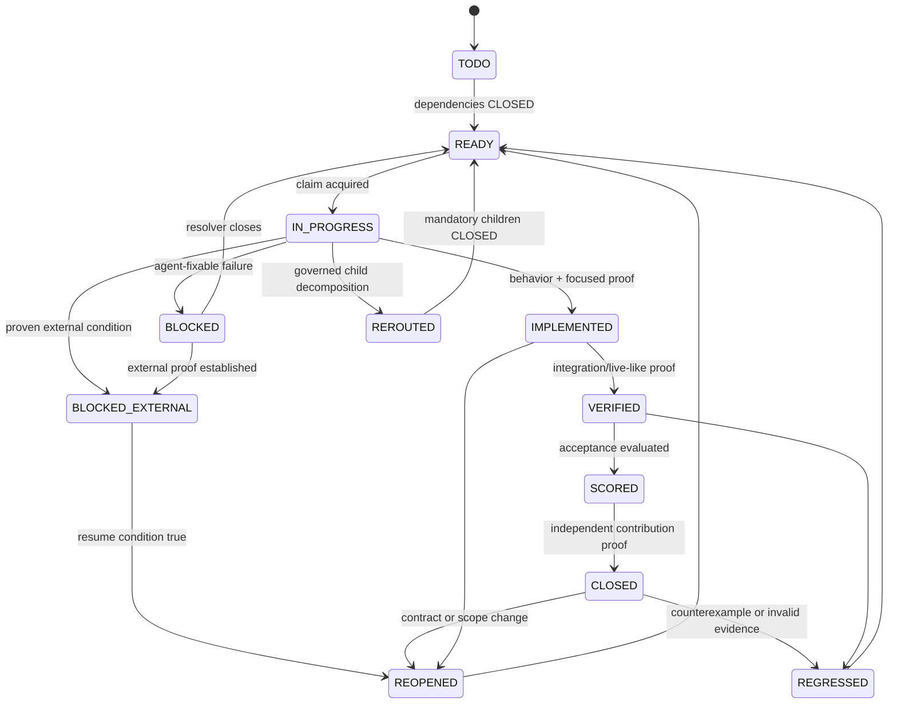
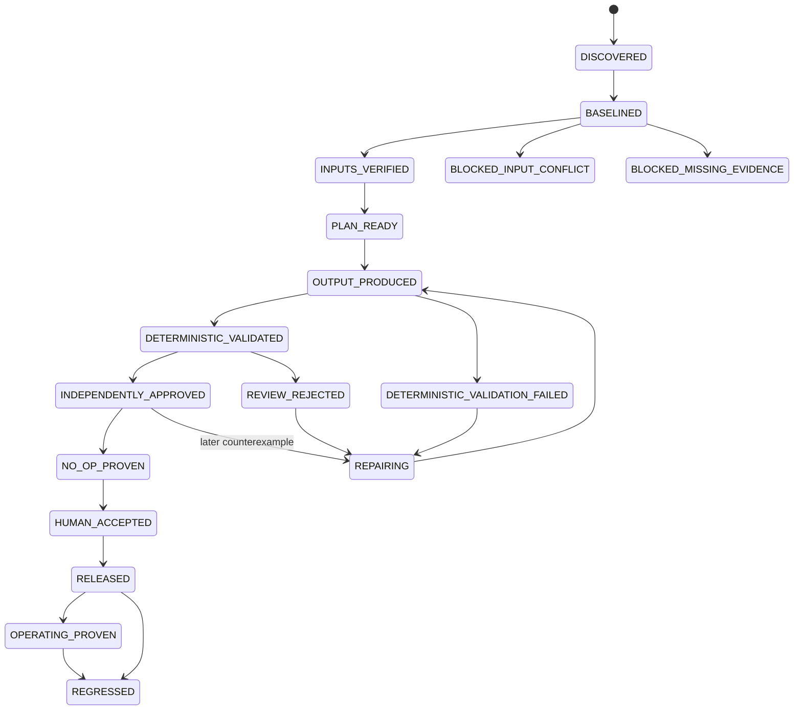

# Planning and Autonomous Execution State Machine

> Status: Reference framework — not itself an operational rule.
> Source: originally authored outside any one repo; copied verbatim into aspose.org's
> own governance docs 2026-07-27, then ported unchanged into this repo 2026-08-29 as
> part of a sync from that repo (see docs/parity/source-anchors.yaml). Zero
> repo-specific content — independently re-verified during that port.
> Operational binding for THIS repo: [docs/governance/planning-methodology.md](../governance/planning-methodology.md).
> Do not treat the schemas below (taskcard YAML, mission graph YAML, durable-state YAML, etc.)
> as literal file formats to create in this repo. See the concordance table in
> [docs/governance/planning-methodology.md](../governance/planning-methodology.md) before
> creating any new tracking artifact — this repo's own equivalents (TASK_BACKLOG.md,
> docs/parity/, .governance/) are named there.

## Purpose

This document defines a reusable method for turning a project goal into an evidence-backed plan,
converting every deliverable into executable taskcards, and coordinating one or many agents through
a durable execution state machine.

The method is intended for projects where:

- the desired outcome is larger than one session or one agent;
- work has dependencies, safety constraints, or human approval boundaries;
- implementation may reveal that earlier assumptions were wrong;
- completion must be proven from artifacts and behavior, not asserted in prose; and
- execution must resume safely after interruption, worker loss, or repository change.

The method is deliberately project-agnostic. A project may implement the schemas in YAML, JSON,
SQL, a workflow engine, or typed application models. The important part is the contract and its
invariants, not a particular orchestration framework.

This is not a replacement for product thinking. The state machine can preserve fidelity to a goal,
but it cannot supply a missing goal. Planning begins by defining the outcome that a user, operator,
or customer can observe.

## The model in one page

Use one authority chain and two related state machines:

```text
vision / product intent
  -> current master plan and decisions
  -> normative requirements
  -> executable taskcard DAG
  -> durable claims and transitions
  -> evidence and independently verified outcomes
```

The two state machines are:

1. **Mission-task state**: whether an implementation task has been selected, implemented,
   verified, accepted, closed, reopened, or blocked.
2. **Deliverable lifecycle state**: how far the actual user-facing output has progressed, such as
   baselined, produced, validated, independently approved, released, or operationally proven.

They must not be conflated. Closing a cache, schema, test harness, or controller task does not
automatically advance a deliverable. Conversely, a deliverable cannot advance without the
supporting tasks and evidence required at that boundary.

The supervisor repeatedly:

```text
read authority and durable state
  -> reconcile changes and expired claims
  -> derive the outcome scoreboard and first failing boundary
  -> select the highest-priority dependency-ready task
  -> claim it with a renewable lease
  -> execute only through that task's acceptance boundary
  -> verify and record evidence
  -> close, repair, reroute, reopen, or classify an external block
  -> recompute eligibility and continue
```

## Normative language

The words **MUST**, **MUST NOT**, **SHOULD**, **SHOULD NOT**, and **MAY** have their ordinary
requirements meaning:

- **MUST / MUST NOT**: required for correctness.
- **SHOULD / SHOULD NOT**: the default; deviation needs a recorded reason.
- **MAY**: optional and project-dependent.

## Core principles

### 1. Keep the outcome immutable and the route revisable

The core goal states the externally observable result. It remains active until the mission closes.
Milestones, phases, technical layers, and taskcards organize the route; they are not substitute
goals.

A useful core goal has this shape:

> Produce `<observable deliverable>` for `<dynamic or explicit scope>`, prove it against
> `<acceptance standard>`, carry it through `<required delivery/operation gates>`, and retain
> `<evidence and safety properties>`.

The route may change when evidence disproves a plan. The goal changes only when an authorized
decision changes the desired product outcome.

### 2. One controller, one task graph, one durable continuation state

Supporting plans, reports, roadmaps, and handovers may explain the work, but only one task graph is
executable and only one durable state store decides what is claimed or complete.

Parallel ledgers create predictable failures:

- two agents believe they own the same task;
- a stale report overrides live state;
- a task is closed in one file and open in another;
- a resumed session selects a different route;
- duplicated work produces conflicting evidence; and
- no authority can decide whether the mission is complete.

Derived views MUST be regenerated from the authoritative graph and durable state. They MUST NOT
become independent queues.

### 3. Plan from acceptance boundaries backward

Do not begin with a list of implementation activities. Begin with the evidence that would make the
outcome acceptable, then work backward:

```text
accepted outcome
  <- independent acceptance evidence
  <- deterministic validation
  <- exact output artifact
  <- executable operation or implementation plan
  <- verified inputs and facts
  <- immutable baseline
```

Each phase and taskcard must name its exit condition before work starts.

### 4. Treat every completion claim as a hypothesis

Code existence, a green unit test, a generated file, or an agent verdict is not sufficient by
itself. A completion claim becomes durable only when:

- every acceptance check passes;
- required negative and regression controls pass;
- the proof matches the exact source and contract versions;
- an independent verifier accepts the proof where independence is required;
- the evidence manifest is complete and checksum-valid; and
- the task's declared contribution to the core goal is demonstrated.

### 5. Repair the first failing boundary

When an end-to-end run fails, identify the earliest boundary whose contract is false. Repair that
owner instead of adding a downstream exception.

Examples:

- a false factual claim belongs to input verification, not copy editing;
- a plan that cannot produce its promised output belongs to planning/composition;
- a byte-identical repair belongs to the repair planner;
- a false reviewer premise belongs to reviewer grounding;
- duplicate execution belongs to claims, leases, or idempotency;
- a stale completion belongs to invalidation and reopening.

### 6. Preserve history, but keep current truth singular

The current plan describes the current intended state. Transition history and decision history are
append-only records explaining how it changed. Do not preserve superseded instructions beside
current instructions and ask agents to reconcile them mentally.

### 7. Separate deterministic and judgment work

Use deterministic code for:

- safety and authorization;
- graph and schema validation;
- dependency resolution;
- state transitions and leases;
- hashing, caching, and invalidation;
- bounded document or code operations;
- validation and evidence integrity; and
- retry, rollback, and effect reconciliation.

Use an agent or model for work that genuinely requires judgment:

- interpreting ambiguous goals or repository evidence;
- comparing viable designs;
- selecting relevant capabilities;
- composing user-facing material;
- reviewing quality and coherence; and
- proposing repairs that rules cannot derive.

Agentic output is a proposal. It crosses a deterministic contract before becoming an effect or an
accepted result.

## Authority and artifact model

Every project SHOULD define the following artifact roles. File names and locations are
project-specific; the ownership boundaries are not.

| Artifact | Owns | Must not own |
| --- | --- | --- |
| Vision or idea | Product outcome, users, operating model, non-negotiable value | Mutable task status |
| Master plan | Current architecture, decisions, sequence, gates, status | Per-worker claims |
| Requirements inventory | Normative obligations and acceptance statements | Execution order by itself |
| Mission task graph | Executable taskcards, dependencies, priorities, contribution bindings | Mutable runtime truth after initialization |
| Durable mission state | Claims, leases, current statuses, transition history, next task | Product intent |
| Deliverable state | Per-output lifecycle and invalidation bindings | Implementation-task status |
| Evidence store | Reproducible proof, manifests, checksums, verifier verdicts | Unverified narrative claims |
| Derived status/report | Human-readable projection of authoritative state | Independent edits or decisions |
| Decision history | Why current decisions changed | Current instructions |

Recommended authority order:

1. vision and authorized product intent;
2. current master plan and decision ledger;
3. normative requirements;
4. executable mission graph;
5. durable mission and deliverable state;
6. evidence;
7. derived reports and supporting narratives.

If two artifacts conflict, the higher authority wins, except that durable state remains the
authority for claims and transitions. A plan may change what should happen next; it does not erase
what has already happened.

## Planning workflow

### Step 0: Establish a trustworthy baseline

Before planning new work:

1. Record repository, branch, revision, dirty-tree fingerprint, dependency-lock hash, and relevant
   tool versions.
2. Identify active workers, processes, leases, branches, or external jobs.
3. Read existing plans, recent history, uncommitted changes, evidence, and status claims.
4. Preserve valuable in-flight work.
5. Reconcile the immediately preceding phase against its claimed acceptance.
6. Classify each existing deliverable as verified, weakly verified, partial, unattempted,
   contradicted, or externally blocked.
7. Run the existing official checks without changing the tree, if safe and practical.

The baseline is evidence, not ceremony. It prevents a plan from assuming a clean tree, closed
requirement, available credential, or proven capability that does not exist.

### Step 1: Write the mission contract

The mission contract MUST define:

- a stable mission ID;
- the immutable core goal;
- users or beneficiaries;
- the observable deliverables;
- the scope and dynamic denominator;
- subordinate goals;
- mandatory acceptance criteria;
- excluded work;
- human authority boundaries;
- safety invariants;
- the chosen execution mechanism;
- the durable continuation source; and
- the final stop condition.

Do not hard-code a changing denominator. If the goal covers all registered tenants, repositories,
customers, data sets, or components, derive the denominator at runtime and bind it to a hash.

### Step 2: Create a goal hierarchy and anti-drift contract

Use one core goal plus a small number of subordinate goals. Typical subordinate goals are:

- **truth**: verified facts, inputs, provenance, and conflicts;
- **deliverable**: the user-visible output;
- **platform**: adjacent surfaces required for a coherent product;
- **autonomy**: safety, restartability, idempotency, and observability;
- **delivery**: human acceptance, staging, release, and deployment; and
- **maturity**: sustained production operation and independent audit.

Every executable task MUST bind to at least one subordinate goal and exactly one concrete core
contribution kind:

| Contribution kind | Meaning |
| --- | --- |
| `visible_deliverable` | Produces or materially improves an observable output |
| `first_boundary_removal` | Removes the currently evidenced earliest blocker |
| `indispensable_safety` | Establishes a condition without which output must not proceed |
| `acceptance_proof` | Supplies required evidence that advances or closes an acceptance boundary |

Tasks whose only contribution is "improve the system", "add tests", "write a schema", or "support
the mission" are incomplete taskcards. Those may be valid activities, but the card must state what
outcome boundary they enable or prove.

### Step 3: Normalize requirements

Translate product statements, constraints, decisions, and discovered gaps into a versioned
requirements inventory. Each requirement SHOULD have:

- stable ID and precise description;
- owner or owning domain;
- priority;
- status;
- acceptance statement;
- evidence standard;
- source authority;
- affected deliverables;
- dependencies or prerequisites;
- safety/permission class;
- implementation and verification references; and
- deprecation or replacement information when applicable.

Statuses should distinguish at least:

- `PLANNED`;
- `PARTIAL`;
- `IMPLEMENTED`;
- `GOVERNANCE`;
- `RESEARCH_GATED`;
- `BACKLOG`; and
- `DEPRECATED`.

An `IMPLEMENTED` requirement is not automatically trusted. During planning, re-evaluate its
evidence semantically. Preserve valid closure; reopen contradicted or weak closure.

Every mandatory, non-deprecated requirement MUST map to exactly one primary taskcard. Other cards
may cite it, but one card owns closure. Backlog and deprecated rows MUST NOT silently become
executable mission work.

### Step 4: Define deliverables and acceptance boundaries

For each deliverable, create a deliverable contract:

| Field | Question |
| --- | --- |
| Identity | What exact artifact or behavior is delivered? |
| Audience | Who observes or relies on it? |
| Scope | Which dynamic or fixed subjects must be covered? |
| Inputs | What source material and facts are admissible? |
| Output | What exact artifact, change, or service behavior results? |
| Quality | What deterministic and judgment standards apply? |
| Safety | What actions, data, or side effects are prohibited? |
| Proof | What evidence makes each boundary acceptable? |
| Idempotency | What must an unchanged rerun do? |
| Invalidation | Which input or contract changes reopen which boundary? |
| Human gate | Which decisions require explicit human authority? |
| Operations | What sustained behavior is needed after release? |

Define the lifecycle as observable boundaries rather than internal phases. A common lifecycle is:

```text
DISCOVERED
  -> BASELINED
  -> INPUTS_VERIFIED
  -> PLAN_READY
  -> OUTPUT_PRODUCED
  -> DETERMINISTIC_VALIDATED
  -> INDEPENDENTLY_APPROVED
  -> NO_OP_PROVEN
  -> HUMAN_ACCEPTED
  -> RELEASED
  -> OPERATING_PROVEN
```

Projects SHOULD rename or extend these boundaries to match their domain. The meaning must be
precise enough that a validator can decide whether evidence satisfies the transition.

### Step 5: Order gates by authority and risk

Gates are not just milestones. They prevent premature work.

A typical order is:

1. local or read-only proof;
2. independent agentic or peer approval;
3. human acceptance;
4. staging or workflow reproduction;
5. narrow authorized external effect;
6. hosted production operation; and
7. sustained maturity evidence.

A downstream gate MUST NOT start because its code already exists. It starts only when all upstream
acceptance conditions are currently valid.

For every gate, define:

- entry predicates;
- permitted effect classes;
- exact exit equation;
- evidence bundle;
- invalidation inputs;
- human authority, if any;
- rollback/recovery path; and
- downstream work that remains prohibited until closure.

### Step 6: Identify uncertainties and investigate before design

For each risky area:

1. state the assumption;
2. identify what evidence could disprove it;
3. inspect the current system and a proven reference;
4. compare build, adopt, wrap, migrate, or defer options;
5. run a bounded characterization or negative control when needed;
6. record the chosen decision and rejected alternatives; and
7. convert unresolved acceptance-critical uncertainty into a taskcard dependency.

Research is complete only when it changes a decision, freezes a contract, or proves that no change
is required. Open-ended characterization is not a deliverable.

### Step 7: Decompose phases by exit condition

Each phase SHOULD contain:

- purpose;
- entry conditions;
- deliverables;
- taskcard IDs;
- permitted actions;
- prohibited actions;
- exit equation;
- evidence location;
- rollback or reopening rule; and
- next gate.

Write the exit first. If the exit cannot be expressed in observable terms, the phase is too vague.

Good:

> Exit when one real representative from every supported platform reaches
> `INDEPENDENTLY_APPROVED` and an unchanged rerun reaches `NO_OP_PROVEN` under one frozen
> campaign.

Weak:

> Exit when platform support is implemented.

### Step 8: Convert deliverables into atomic taskcards

Use the following decomposition algorithm:

1. Start with one acceptance boundary.
2. Name the artifact or behavior that crosses it.
3. Identify the earliest currently failing precondition.
4. Identify the single owner responsible for that precondition.
5. Create a card that closes that complete behavior.
6. Split a characterization or negative-control card immediately before risky implementation.
7. Split again if the card spans multiple independent concerns, owners, permission classes, or
   rollback units.
8. Bind the card to requirements and a core contribution.
9. Define focused proof, independent proof, negative controls, regression checks, and evidence.
10. Add only true dependencies: conditions that must be closed before this card can be correct.
11. Define failure rerouting and invalidation.
12. Confirm that one coherent change can close the card without relying on undocumented future
    work.

A taskcard is atomic when:

- one owner can claim it;
- its allowed change surface is bounded;
- its acceptance can be evaluated independently;
- its rollback does not require rolling back unrelated work;
- failure has one first owning boundary;
- it can be resumed without repeating accepted effects; and
- closing it produces a coherent, reviewable slice.

Atomic does not mean tiny. A card may involve several files and tests if they form one complete
behavior. A one-line edit is not atomic if it cannot be accepted without an unstated later card.

### Step 9: Build and validate the DAG

The task graph MUST:

- use unique, stable, semantic task IDs;
- reject dangling dependencies;
- reject cycles before execution;
- reject unknown goal and requirement IDs;
- reject multiple primary owners for one requirement;
- reject vague contribution statements;
- reject invalid status seeds;
- reject externally blocked cards without required attempt evidence;
- distinguish parent aggregation from dependency satisfaction; and
- define deterministic task ordering.

Only successful closure SHOULD satisfy a dependency. `REROUTED`, `BLOCKED_EXTERNAL`, or
`DEFERRED_WITH_REASON` describes disposition; it does not prove the prerequisite.

Parent cards aggregate children. A rerouted parent reopens after all mandatory children close,
validates an aggregate evidence bundle, and then closes. Children do not silently make a parent
successful.

### Step 10: Freeze a campaign before scaling

Large fan-out multiplies every upstream defect. Before processing a portfolio or broad target set,
qualify representative end-to-end outputs and freeze the execution contract.

A campaign identity SHOULD bind:

- source-control revision and dirty-tree fingerprint;
- registry or target-set hash;
- immutable target revisions;
- dependency-lock and environment-image hashes;
- requirement and task-graph hashes;
- prompt, template, policy, and model-route hashes;
- input/fact acceptance contract;
- renderer or implementation contract;
- validator and reviewer standards;
- lifecycle and evidence schema versions; and
- authorization policy.

Any mutation creates a new campaign or invalidates only the dependent stages. It MUST NOT silently
move the target while a sweep is in progress.

## Canonical schemas

The following schemas are reference contracts. Implementations SHOULD validate strictly and reject
unknown fields unless an explicit extension namespace is provided.

### Mission graph schema

```yaml
schema_version: 1

execution_contract:
  mechanism_type: autonomous_supervision
  entry_point: "project-agent execute"
  invocation: "project-agent execute --mission control/mission-graph.yaml"
  task_source: "control/mission-graph.yaml"
  governing_state: "versioned durable mission state"
  continuation_source: "dependency-ready taskcards"
  continuation_consumer: "mission supervisor"
  stop_evaluator: "mission completion evaluator"
  resume_strategy: "reload graph and durable state; reconcile; reclaim or select"
  concurrency_policy:
    max_parallel_workers: 4
    claim_scope: "task"
    conflict_detection: "declared lock scopes plus overlapping allowed paths"
  mechanism_locked: true

mission_authority:
  mission_id: "CUSTOMER-DATA-EXPORT"
  mission_summary: >
    Deliver a secure, documented, independently verified customer export for every eligible
    account and prove safe unchanged reruns before production rollout.
  governing_plan_path: "plans/master.md"
  current_phase: "verified local delivery"
  in_scope_outcomes:
    - "export archive"
    - "operator documentation"
    - "safe resumable execution"
  out_of_scope_items:
    - "automatic deletion of source records"
  mandatory_acceptance_criteria:
    - "Every eligible account has a checksum-valid export."
    - "An unchanged rerun creates no duplicate archive."
    - "No export crosses tenant boundaries."
  human_authority_boundaries:
    - "Production rollout approval"
  core_goal:
    goal_id: "GOAL-SECURE-CUSTOMER-EXPORT"
    summary: "Deliver a safe, complete, reproducible export for the dynamic eligible-account set."
    acceptance_boundary: "Production operation and independent audit are complete."
  subordinate_goals:
    - goal_id: "GOAL-EXPORT-TRUTH"
      summary: "Verify account scope, ownership, and exportable records."
      acceptance_boundary: "All required input facts are accepted or narrowly blocked."
    - goal_id: "GOAL-EXPORT-DELIVERABLE"
      summary: "Produce and validate the customer-visible export package."
      acceptance_boundary: "Every eligible package is approved and no-op proven."
  mission_locked: true

verified_baseline:
  repository: "example/customer-export"
  branch: "main"
  revision: "0123456789abcdef"
  dirty_tree_fingerprint: "sha256:..."
  dependency_lock_sha256: "..."
  active_claims_observed: []
  checks:
    - command: "project-test --official"
      exit_code: 0
      started_at: "2027-01-10T10:00:00Z"
      completed_at: "2027-01-10T10:05:00Z"

taskcards: []

requirement_coverage:
  requirements_path: "plans/requirements.yaml"
  requirements_sha256: "..."
  total_rows: 0
  mandatory_rows: 0
  mappings: []
```

### Taskcard schema

```yaml
task_id: "CUSTOMER-EXPORT-VERIFY-TENANT-BOUNDARY"
mission_id: "CUSTOMER-DATA-EXPORT"
parent_task_id: "CUSTOMER-EXPORT-LOCAL-ACCEPTANCE"
title: "Prove that export selection cannot cross tenant boundaries"

source_finding: >
  The current selector accepts an account ID but does not bind every selected record to the
  authenticated tenant in its final query.
audit_classification: "final_outcome_blocker"

priority: "P0"
lane: "export-truth"
owner_role: "data-boundary-specialist"
seed_status: "TODO"

objective: >
  Bind every export query to the authenticated tenant and fail closed when record ownership
  cannot be verified.
why_it_matters: >
  A complete export is unacceptable if it can include another customer's data.

goal_ids:
  - "GOAL-EXPORT-TRUTH"
core_contribution:
  kind: "indispensable_safety"
  summary: >
    Establish the tenant-isolation proof required before any customer export package may be
    accepted.

requirement_ids:
  - "EXPORT-SECURITY-TENANT-ISOLATION"

allowed_paths:
  - "src/export/query/"
  - "tests/security/export/"
  - "docs/export-security.md"
forbidden_paths:
  - "production-data/"
  - "deployment/"

dependencies:
  - "CUSTOMER-EXPORT-FREEZE-ACCOUNT-IDENTITY"
stage_limit: "INPUTS_VERIFIED"

expected_outputs:
  - "Tenant-bound export query contract"
  - "Cross-tenant rejection evidence"

acceptance_checks:
  - id: "tenant-filter-is-structural"
    assertion: "Every export query requires the authenticated tenant key."
  - id: "unknown-ownership-fails-closed"
    assertion: "A record without verified ownership is excluded and reported."

verification:
  focused:
    - "Unit tests for tenant-bound query construction"
  integration:
    - "Local database proof with two tenants"
  live_like:
    - "Read-only staging reproduction using synthetic tenant records"
  independent:
    - "Security verifier reconstructs selection from query logs"

negative_controls:
  - "A record with a matching account ID but a different tenant is rejected."
  - "A caller-supplied tenant ID cannot override authenticated identity."

regression_checks:
  - "Existing export ordering and pagination tests"
  - "Official security suite"

evidence_requirements:
  - "Before/after query-plan capture"
  - "Test command log with revision and exit code"
  - "Independent verifier verdict"
  - "SHA-256 inventory"

permission_class: "repository_write"
side_effect_class: "repository_change"
idempotency_inputs:
  - "source_revision"
  - "schema_version"
  - "tenant-boundary-contract-hash"
retry_policy: "no automatic retry after an unknown partial write"

concurrency:
  lock_scopes:
    - "contract:tenant-bound-export-query"
    - "path:src/export/query"
  compatible_lanes:
    - "export-documentation"

invalidation_inputs:
  - "account identity schema"
  - "export query contract"
  - "authorization policy"

time_budget:
  focused_minutes: 30
  total_minutes: 180
cost_budget:
  external_calls: 0

rollback_or_recovery: >
  Revert only the tenant-query seam and retain failing security evidence for diagnosis.
failure_reroute: >
  Reopen account-identity verification if ownership cannot be established; otherwise create a
  resolver under this parent for the first failing query boundary.

closeout_rules:
  - "Every acceptance check passes."
  - "The independent verifier accepts the evidence."
  - "The task contribution record matches the current outcome scoreboard."

blocker_attempts: []
exact_external_action: null
exact_resume_condition: null
```

#### Taskcard field rules

| Field | Rule |
| --- | --- |
| `task_id` | Stable, unique, semantic, and never reused |
| `parent_task_id` | Aggregation only; not a substitute for dependencies |
| `source_finding` | Evidence-based reason the card exists |
| `audit_classification` | One of verified, weakly verified, partial, unattempted, contradicted, blocker, or hardening |
| `priority` | Product/risk priority, not whoever asked most recently |
| `lane` | Owning domain used for routing and concurrency |
| `owner_role` | Capability or role; runtime worker identity belongs in the claim |
| `seed_status` | Initial graph seed only; durable state wins after initialization |
| `objective` | Complete behavior the card will establish |
| `why_it_matters` | Outcome rationale; must differ from the objective |
| `goal_ids` | At least one known subordinate goal |
| `core_contribution` | One measurable contribution kind and summary |
| `allowed_paths` | Maximum intended change surface |
| `forbidden_paths` | Explicit no-touch surface and authority boundary |
| `dependencies` | Cards that must be `CLOSED`, not merely terminal |
| `stage_limit` | Furthest deliverable boundary this card may execute |
| `expected_outputs` | Concrete artifacts or behavior |
| `acceptance_checks` | Exhaustive assertions required for closure |
| `verification` | Focused, integration, live-like, and independent proof as applicable |
| `negative_controls` | Cases that must fail or be rejected |
| `regression_checks` | Previously valid behavior that must remain valid |
| `evidence_requirements` | Exact records needed for acceptance |
| `permission_class` | Read/write/network/production authority needed |
| `side_effect_class` | None, local artifact, repository change, remote proposal, or production effect |
| `idempotency_inputs` | Inputs whose equality must make reuse or no-op decidable |
| `retry_policy` | Bounded behavior after known and unknown outcomes |
| `concurrency` | Lock scopes and lanes that may safely execute at the same time |
| `invalidation_inputs` | Contract changes that reopen this card or downstream deliverables |
| `rollback_or_recovery` | Safe response to partial or regressed work |
| `failure_reroute` | First owning boundary for repair |
| `closeout_rules` | Conditions in addition to ordinary acceptance checks |

### Requirement coverage schema

```yaml
requirement_coverage:
  source_path: "plans/requirements.yaml"
  source_sha256: "..."
  total_requirement_rows: 42
  mandatory_requirement_rows: 36
  excluded_backlog_rows: 4
  excluded_deprecated_rows: 2
  reopened_implemented_rows: 1
  mappings:
    - requirement_id: "EXPORT-SECURITY-TENANT-ISOLATION"
      priority: "P0"
      requirement_status: "PARTIAL"
      task_id: "CUSTOMER-EXPORT-VERIFY-TENANT-BOUNDARY"
      disposition: "open_mandatory"
      semantic_findings:
        - "Final record query is not structurally tenant-bound."
```

Required validation:

- every requirement ID appears exactly once;
- every mapped task exists;
- mandatory rows map to executable or valid closed tasks;
- backlog and deprecated rows are explicitly excluded;
- `IMPLEMENTED` with a semantic contradiction is reopened;
- each task's `requirement_ids` exactly matches reverse mappings; and
- coverage totals reconcile with unique mappings.

### Durable mission state schema

The graph is declarative. Mutable status belongs in a separate, versioned record.

```yaml
schema_version: 1
mission_id: "CUSTOMER-DATA-EXPORT"
graph_sha256: "..."
state_version: 18

task_statuses:
  CUSTOMER-EXPORT-FREEZE-ACCOUNT-IDENTITY: "CLOSED"
  CUSTOMER-EXPORT-VERIFY-TENANT-BOUNDARY: "IN_PROGRESS"

active_claims:
  CUSTOMER-EXPORT-VERIFY-TENANT-BOUNDARY:
    claim_id: "0194d49a..."
    claimed_by: "worker-data-boundary-asia-01"
    claimed_at: "2027-01-10T10:10:00Z"
    claim_expires_at: "2027-01-10T10:40:00Z"
    last_heartbeat_at: "2027-01-10T10:25:00Z"
    lock_scopes:
      - "contract:tenant-bound-export-query"
      - "path:src/export/query"

transition_history:
  - event_id: "0194d49b..."
    task_id: "CUSTOMER-EXPORT-VERIFY-TENANT-BOUNDARY"
    from_status: "READY"
    to_status: "IN_PROGRESS"
    observed_by: "worker-data-boundary-asia-01"
    reason: "Highest-priority dependency-ready task"
    evidence_refs: []
    occurred_at: "2027-01-10T10:10:00Z"

outcome_scoreboard:
  denominator: 120
  baselined: 120
  inputs_verified: 95
  output_produced: 80
  deterministic_validated: 77
  independently_approved: 70
  no_op_proven: 68
  human_accepted: 0
  first_failing_boundary: "INPUTS_VERIFIED"
  source_hash: "..."
  derived_at: "2027-01-10T10:25:00Z"

next_task:
  task_id: "CUSTOMER-EXPORT-VERIFY-TENANT-BOUNDARY"
  goal_ids:
    - "GOAL-EXPORT-TRUTH"
  core_contribution:
    kind: "indispensable_safety"
    summary: "Establish the tenant-isolation proof required before package acceptance."

mission_complete: false
last_evaluated_at: "2027-01-10T10:25:00Z"
```

The state store SHOULD provide compare-and-swap or an equivalent transaction. A write includes the
version read by the worker; a stale version fails and is reconciled rather than overwritten.

### Transition event schema

```yaml
schema_version: 1
event_id: "0194d49b..."
mission_id: "CUSTOMER-DATA-EXPORT"
task_id: "CUSTOMER-EXPORT-VERIFY-TENANT-BOUNDARY"
from_status: "IN_PROGRESS"
to_status: "IMPLEMENTED"
observed_by: "worker-data-boundary-asia-01"
reason: "Tenant-bound query behavior implemented and focused checks pass."
evidence_refs:
  - "evidence/customer-export-tenant-boundary/implementation-manifest.json"
graph_sha256: "..."
source_revision: "..."
occurred_at: "2027-01-10T11:30:00Z"
```

Transition history is append-only. Correct a bad status with a new transition; do not rewrite
history.

### Deliverable lifecycle state schema

```yaml
schema_version: 1
deliverable_id: "account-8452-export"
scope_key: "account-8452"
status: "DETERMINISTIC_VALIDATED"
source_revision: "account-data-snapshot-2027-01-10T09:00:00Z"

bindings:
  input_facts_hash: "..."
  plan_hash: "..."
  output_hash: "..."
  validator_contract_hash: "..."
  reviewer_standard_hash: null
  protected_content_fingerprint: "..."
  campaign_id: "secure-export-local-acceptance-2027-01"

attempts:
  repair_attempts_for_revision: 0
  external_call_attempts: 0

history:
  - from_status: "OUTPUT_PRODUCED"
    to_status: "DETERMINISTIC_VALIDATED"
    reason: "Archive structure, ownership, and checksum checks passed."
    observed_by: "export-validator"
    evidence_refs:
      - "runs/account-8452/review/deterministic-validation.json"
    occurred_at: "2027-01-10T11:20:00Z"

details:
  archive_path: "runs/account-8452/output/customer-export.zip"
```

The deliverable state MUST bind terminal claims to the exact input and contract hashes used to
earn them.

### Contribution evidence schema

Task closure needs proof that the declared contribution occurred.

```yaml
schema_version: 1
task_id: "CUSTOMER-EXPORT-VERIFY-TENANT-BOUNDARY"
goal_ids:
  - "GOAL-EXPORT-TRUTH"
core_contribution:
  kind: "indispensable_safety"
  summary: "Establish the tenant-isolation proof required before package acceptance."

acceptance_checks_passed:
  - "tenant-filter-is-structural"
  - "unknown-ownership-fails-closed"

proof_refs:
  - "evidence/customer-export-tenant-boundary/security-verdict.json"
  - "evidence/customer-export-tenant-boundary/query-plan-capture.json"

scoreboard_before_sha256: "..."
scoreboard_after_sha256: "..."
first_failing_boundary_before: "INPUTS_VERIFIED"
first_failing_boundary_after: "INPUTS_VERIFIED"

independent_verifier:
  verifier_id: "export-security-verifier"
  verdict: "ACCEPT"
  verdict_hash: "..."
```

A safety task may legitimately leave the numerical scoreboard unchanged. Its evidence must prove
that it established a mandatory safety condition. A `first_boundary_removal` task, however, cannot
close when both the scoreboard and first failing boundary are unchanged.

### Evidence manifest schema

```yaml
schema_version: 1
manifest_id: "customer-export-tenant-boundary-implementation"
mission_id: "CUSTOMER-DATA-EXPORT"
task_id: "CUSTOMER-EXPORT-VERIFY-TENANT-BOUNDARY"
campaign_id: "secure-export-local-acceptance-2027-01"

source:
  repository: "example/customer-export"
  branch: "main"
  revision: "..."
  dirty_tree_fingerprint: "..."
  graph_sha256: "..."
  requirements_sha256: "..."
  dependency_lock_sha256: "..."

execution:
  worker_id: "worker-data-boundary-asia-01"
  started_at: "2027-01-10T10:10:00Z"
  completed_at: "2027-01-10T11:35:00Z"
  commands:
    - command_id: "tenant-boundary-focused-tests"
      command: "project-test tests/security/export"
      exit_code: 0
      stdout_sha256: "..."
      stderr_sha256: "..."

artifacts:
  - path: "security-verdict.json"
    sha256: "..."
    media_type: "application/json"
  - path: "query-plan-capture.json"
    sha256: "..."
    media_type: "application/json"

verification:
  deterministic_passed: true
  independent_verifier_id: "export-security-verifier"
  independent_verdict: "ACCEPT"
  independent_verdict_sha256: "..."

effects:
  permission_class: "repository_write"
  effect_ids: []
  prohibited_effects_observed: false

redaction:
  policy_version: 1
  secrets_detected: 0

manifest_content_sha256: "..."
```

Evidence MUST be:

- attributable to one task, deliverable, run, and source revision;
- redacted before persistence;
- checksum-complete;
- reproducible from recorded commands or procedures;
- independently verifiable where required;
- immutable after acceptance; and
- rejected if the tree or governing contract changed during the proof.

`manifest_content_sha256` is computed over a canonical serialization with that field omitted. A
detached checksum file is an equally valid design. Do not define a self-referential checksum.

### Campaign manifest schema

```yaml
schema_version: 1
campaign_id: "secure-export-local-acceptance-2027-01"
created_at: "2027-01-10T09:00:00Z"
status: "QUALIFIED"

scope:
  registry_path: "config/eligible-accounts.json"
  registry_sha256: "..."
  denominator: 120
  target_revisions_sha256: "..."

contracts:
  control_revision: "..."
  dirty_tree_fingerprint: "..."
  task_graph_sha256: "..."
  requirements_sha256: "..."
  dependency_lock_sha256: "..."
  environment_image_digest: "sha256:..."
  input_acceptance_contract_sha256: "..."
  implementation_plan_contract_sha256: "..."
  validator_contract_sha256: "..."
  reviewer_standard_sha256: "..."
  evidence_schema_version: 1
  lifecycle_schema_version: 1

qualification:
  representative_ids:
    - "small-account"
    - "large-account"
    - "account-with-attachments"
  evidence_manifest: "evidence/export-campaign-qualification/manifest.json"
  zero_critical_false_accepts: true
  unchanged_rerun_proven: true

invalidation_rules:
  - input: "reviewer_standard_sha256"
    earliest_reopened_boundary: "INDEPENDENTLY_APPROVED"
  - input: "validator_contract_sha256"
    earliest_reopened_boundary: "DETERMINISTIC_VALIDATED"
```

## Mission-task state machine

### States

| State | Meaning |
| --- | --- |
| `TODO` | Known work whose dependencies are not yet satisfied |
| `READY` | Dependencies are closed and the card may be claimed |
| `IN_PROGRESS` | Exactly one valid worker claim owns execution |
| `IMPLEMENTED` | Expected behavior exists and focused checks pass |
| `VERIFIED` | Integration, regression, safety, and required live-like proof pass |
| `SCORED` | Acceptance checks and quality thresholds are evaluated |
| `CLOSED` | Contribution evidence is independently accepted and the card is complete |
| `BLOCKED` | Agent-fixable impediment; not acceptable as final |
| `BLOCKED_EXTERNAL` | Proven external authority or infrastructure impediment |
| `REROUTED` | Work delegated to explicit children; dependency remains unsatisfied |
| `DEFERRED_WITH_REASON` | Governed removal from current execution scope |
| `REOPENED` | Earlier closure or disposition must be evaluated again |
| `REGRESSED` | Previously accepted behavior or an active claim is no longer valid |

### Primary flow



### Transition guards

1. `TODO -> READY` requires all dependencies to be `CLOSED`.
2. `READY -> IN_PROGRESS` requires a durable exclusive claim.
3. `IMPLEMENTED`, `VERIFIED`, `SCORED`, and `CLOSED` require evidence references.
4. `CLOSED` requires exactly one matching contribution-evidence record.
5. `CLOSED` requires all card acceptance checks, not a subset.
6. The independent verifier cannot be the producer identity.
7. `REROUTED` does not satisfy dependencies.
8. `BLOCKED` defaults to agent-fixable and creates or reopens a resolver.
9. `BLOCKED_EXTERNAL` requires the external action and exact resume condition.
10. `REOPENED` and `REGRESSED` preserve previous history and evidence.
11. Only one task may hold a given lock scope. Multiple tasks may be active only when the graph
    and state backend support independent concurrent claims and their scopes do not conflict.
12. Mission closure requires every mandatory card to be `CLOSED`; terminal exceptions do not count.

### External block standard

An external block is appropriate only for conditions such as:

- missing human authorization;
- unavailable credential or permission owned outside the project;
- confirmed provider or infrastructure outage;
- a legitimate unexpired claim held by another worker;
- a required external fact that no authorized source can currently provide; or
- required elapsed time.

Before using `BLOCKED_EXTERNAL`, the card SHOULD record at least three materially distinct attempts
when three safe attempts are possible. Each attempt records:

```yaml
blocker_id: "customer-export-staging-credential"
attempt_number: 1
hypothesis: "Credential exists but is not loaded in this environment."
first_failing_boundary: "staging authentication preflight"
evidence_considered:
  - "redacted preflight result"
action_taken: "Checked documented secret provider and environment mapping."
verification_run:
  - "project-agent preflight --staging"
result: "Credential remains unavailable."
new_information: "No configured staging secret reference exists."
reason_for_next_attempt: "Check whether workload identity is the intended provider."
```

The final block also names:

- `exact_external_action`: what an authorized external party must do; and
- `exact_resume_condition`: the machine-observable condition that makes the task eligible again.

If the problem is code, wiring, planning, validation, or an unsupported but buildable capability,
it is agent-fixable.

## Deliverable lifecycle state machine

The deliverable lifecycle is domain-specific but follows a common acceptance pattern:



### Boundary definitions

| Boundary | Minimum evidence |
| --- | --- |
| `BASELINED` | Immutable source identity, exact input bytes/data, revision, and inventory |
| `INPUTS_VERIFIED` | Required facts accepted with provenance; conflicts and missing evidence explicit |
| `PLAN_READY` | Executable bounded operations or implementation plan with full acceptance coverage |
| `OUTPUT_PRODUCED` | Exact output plus diff or derivation from immutable source and plan |
| `DETERMINISTIC_VALIDATED` | All deterministic, safety, and integrity checks pass |
| `INDEPENDENTLY_APPROVED` | Separate reviewer accepts quality, truth, and plan fidelity |
| `NO_OP_PROVEN` | Identical inputs cause no duplicate effects or unnecessary paid work |
| `HUMAN_ACCEPTED` | Authorized human records acceptance after independent approval |
| `RELEASED` | Authorized effect reconciled and independently verified |
| `OPERATING_PROVEN` | Required duration, health, recovery, and audit thresholds pass |

### Stage-bounded execution

Each taskcard MUST declare the furthest deliverable boundary it may invoke. A task to fix input
truth cannot automatically continue into output generation, paid review, or release.

Stage bounds:

- reduce cost while contracts are moving;
- prevent downstream artifacts from masquerading as upstream proof;
- make task acceptance precise;
- limit side effects;
- improve recovery; and
- expose the first failing boundary.

The supervisor fails closed if a capability would cross the active card's stage limit.

## Deterministic selection and continuation

### Eligibility

A task is eligible when:

- its durable status is `TODO`, `READY`, `REOPENED`, or `REGRESSED`;
- every dependency is `CLOSED`;
- it is not prohibited by the current gate;
- required permission is available;
- its stage is within the current campaign;
- no valid conflicting claim exists; and
- any exact resume condition is true.

### Ordering

Select deterministically using:

1. lowest priority number (`P0` before `P1`);
2. task that owns the current first failing outcome boundary;
3. critical-path or parent order if explicitly modeled;
4. stable semantic task ID as the final tie-breaker.

Do not let file order, worker preference, or model output decide between otherwise equal tasks.

### Supervisor pseudocode

```python
while True:
    authority = load_and_validate_authority()
    graph = load_and_validate_task_graph()
    state = durable_state.load_with_version()

    state = reconcile_graph_additions_without_deleting_history(graph, state)
    state = recover_expired_claims(state)
    state = invalidate_stale_acceptance_bindings(state, authority)
    scoreboard = derive_outcome_scoreboard()
    state = persist_scoreboard_and_next_task(state, scoreboard)

    if mission_is_closed(graph, state, scoreboard):
        emit_terminal_manifest()
        break

    ready = dependency_ready_tasks(graph, state, scoreboard)
    if not ready:
        if only_exact_external_blocks_remain(graph, state):
            emit_blocked_status_with_resume_conditions()
            break
        create_or_reopen_resolver_for_first_agent_fixable_gap()
        continue

    task = deterministic_select(ready, scoreboard.first_failing_boundary)
    claim = compare_and_swap_claim(task, worker_id, lease_duration)
    if claim.was_stale:
        continue

    try:
        execute_only_to_stage_limit(task)
        evidence = verify_and_write_evidence(task)
        transition_through_acceptance_states(task, evidence)
    except AgentFixableFailure as failure:
        record_first_failing_boundary(failure)
        create_or_reopen_resolver(task, failure)
    except ExternalBlock as block:
        record_external_attempt_and_resume_condition(block)
    finally:
        safely_release_or_expire_claim(claim)
```

### Stop conditions

An execution turn may stop only when one of these is true:

- the mission is genuinely closed;
- all remaining work is externally blocked with exact resume conditions;
- an authorized human decision is required now;
- the selected execution environment is unavailable and no safe alternative exists; or
- the supervisor is intentionally bounded by a requested stage, time, or cost limit.

A session boundary, completed commit, token limit, failed test, or agent-fixable defect is not a
mission stop condition.

## Multi-agent coordination

### Roles versus workers

Taskcards name an `owner_role`, such as `security-verifier` or `frontend-specialist`. Runtime
claims name a concrete `claimed_by` worker. This permits agents to come and go without rewriting
the graph.

### Claim and lease rules

1. Claims are stored durably using compare-and-swap.
2. A claim includes a unique claim ID, worker ID, start time, expiry, and heartbeat.
3. Long-running work renews its lease before expiry.
4. A worker MUST verify ownership immediately before any gated effect.
5. A different worker MUST NOT steal an unexpired claim.
6. Expiry creates an append-only recovery transition, usually `IN_PROGRESS -> REGRESSED`.
7. Reclaim resumes from accepted checkpoints; it does not blindly repeat the task.
8. Releasing a claim is best-effort but observable. A failed release relies on bounded expiry and
   is recorded.

### Concurrency scopes

Define locks at the smallest correct scope:

| Scope | Use |
| --- | --- |
| Task claim | One worker owns one taskcard |
| Artifact or path lease | Prevent overlapping writes to the same source surface |
| Deliverable lease | Prevent duplicate processing of one target |
| Campaign writer lease | Prevent two portfolio sweeps mutating the same summary/state |
| Effect idempotency key | Prevent duplicate external effects after retry or lost response |

A global lock is simple but unnecessarily serial. Per-target locks scale but do not prevent two
portfolio controllers from racing on shared campaign state. Compose scopes where necessary.

### File overlap and shared worktrees

When agents share a repository:

- preserve uncommitted work;
- inspect current content and recent history before overwriting;
- use `allowed_paths` and `forbidden_paths`;
- detect overlap before claiming parallel cards;
- do not reset, clean, restore, or force-update shared state;
- split independent work by module, artifact, or deliverable;
- require coordination for shared manifests, registries, or central plans; and
- record source revision and dirty-tree fingerprint in evidence.

If the tree changes during a verification run, that proof is invalid unless the changed paths are
provably outside the run's dependency set and the evidence contract explicitly permits it.

### Independent verification

Independence is a role and evidence property, not merely a second prompt call.

The verifier:

- did not author the proposal being accepted;
- receives the exact candidate or behavior and admissible evidence;
- has a separately defined acceptance contract;
- cites concrete spans, facts, logs, or test results;
- cannot silently widen permissions;
- cannot mark its own unsupported premises as truth; and
- emits a structured verdict with a checksum.

For high-risk work, use distinct quality and factual/safety reviewers, then combine their verdicts
deterministically.

## Verification strategy

Every taskcard chooses proof proportional to its claim.

### Proof layers

1. **Schema and static checks**: malformed contracts, unknown IDs, forbidden dependencies, lint,
   type checks, and policy violations.
2. **Focused tests**: smallest deterministic proof of the new behavior.
3. **Negative controls**: deliberately invalid input or behavior is rejected.
4. **Regression checks**: previously accepted behavior remains valid.
5. **Integration proof**: behavior crosses public subsystem seams.
6. **Safety proof**: authorization, isolation, redaction, and prohibited-effect checks.
7. **Live-like proof**: real data and production-shaped infrastructure without unauthorized
   effects.
8. **Independent verification**: separate acceptance authority reconstructs the claim.
9. **No-op and recovery proof**: unchanged rerun, interruption, duplicate trigger, retry, and
   lost-response behavior.
10. **Operational proof**: sustained health, alerts, reconciliation, and audit over time.

Unit tests are necessary but do not prove production behavior by themselves.

### Negative controls are first-class

Positive-only tests often prove that a mechanism can succeed, not that it rejects false success.
Every acceptance-critical task SHOULD include controls for:

- missing input;
- contradictory input;
- malformed schema;
- stale cache;
- unauthorized action;
- duplicate invocation;
- partial effect;
- false reviewer premise;
- output/plan disagreement;
- unchanged ineffective repair;
- source revision drift; and
- evidence corruption.

### No-op proof

An unchanged rerun SHOULD prove:

- no new external effect;
- no duplicate artifact;
- no unnecessary agent/model call;
- no duplicate transition event;
- no changed output hash;
- no lost evidence;
- correct cache provenance; and
- the same acceptance validators still run or are safely reused under an exact contract hash.

Caching is not acceptance. Reuse is valid only when the current contract re-evaluates the cached
record successfully.

## Invalidation, reopening, and replanning

### Invalidation matrix

Define the earliest boundary affected by each change:

| Changed input | Earliest boundary normally reopened |
| --- | --- |
| Source data or source revision | `BASELINED` |
| Fact/evidence contract | `INPUTS_VERIFIED` |
| Plan or operation schema | `PLAN_READY` |
| Renderer, compiler, or implementation logic | `OUTPUT_PRODUCED` |
| Deterministic validator | `DETERMINISTIC_VALIDATED` |
| Reviewer prompt/model/standard | `INDEPENDENTLY_APPROVED` |
| Idempotency contract | `NO_OP_PROVEN` |
| Human acceptance scope | `HUMAN_ACCEPTED` |
| Deployment/effect contract | `RELEASED` |
| Operational SLO or audit standard | `OPERATING_PROVEN` |

Invalidate only dependent stages, but never preserve a later stage whose prerequisite reopened.

### Counterexample-driven reopening

A real counterexample overrides an earlier green test or accepted report. When one appears:

1. preserve the failing artifact and evidence;
2. identify the first responsible boundary;
3. transition its owning task to `REGRESSED` or `REOPENED`;
4. invalidate dependent deliverables;
5. add the counterexample to the permanent acceptance corpus;
6. repair the owning contract;
7. requalify a representative;
8. issue a new campaign identity if a frozen contract changed; and
9. rerun only affected targets.

Do not patch one target with a special case unless the product standard truly requires a
target-specific policy and that decision is recorded.

### Replanning rules

Replanning is expected when evidence changes. It MUST:

- keep the same core goal unless authorized intent changes;
- use the same authoritative graph and durable state;
- preserve transition history and accepted artifacts;
- add, reopen, reroute, or deprecate taskcards explicitly;
- update requirement coverage;
- recompute graph hash and reconcile state;
- not steal active claims;
- state what evidence invalidated the old route; and
- preserve unaffected accepted work.

A new supporting document is not a new controller.

## Blocker and failure routing

Use this classification:

| Class | Response |
| --- | --- |
| Validation or implementation defect | Agent-fixable; create/reopen resolver |
| Missing supported capability | Agent-fixable unless authority forbids building it |
| Ambiguous planner output | Agent-fixable; repair contract or planner |
| Test or evidence harness defect | Agent-fixable; repair proof boundary |
| Transient provider failure | Bounded retry, then exact external block if still unavailable |
| Valid concurrent claim | Wait/retry; external until lease expires or is released |
| Missing human authorization | External block with exact requested action |
| Missing credential owned externally | External block; continue unrelated ready work |
| Unknown/unclassified failure | Agent-fixable by default |

An `agent_fixable` block MUST NOT become mission completion. A `BLOCKED_EXTERNAL` card also prevents
mission closure unless the mission contract explicitly excludes it through an authorized scope
change.

## Effects, permissions, and human boundaries

Every task and capability SHOULD declare:

- required permission class;
- side-effect class;
- authorized scope;
- idempotency key inputs;
- retry policy;
- reconciliation procedure;
- rollback or compensating action;
- evidence required before effect;
- evidence required after effect; and
- human approval requirement.

Recommended permission classes:

```text
read_only_local
read_only_network
local_artifact_write
repository_write
remote_proposal_write
production_effect
```

Human approval must be explicit and instance-specific for irreversible, externally visible, or
privileged effects. The approval record states:

- **what** exact content or effect will occur;
- **why** it is needed;
- **where** it will occur;
- **who** approved it;
- **when** it expires; and
- which content/effect hash it authorizes.

A standing approval for one effect does not authorize a different one.

## Evidence and observability

The system SHOULD expose:

- current graph and graph hash;
- active claim and lease expiry;
- ready tasks in deterministic order;
- exact next task and its contribution;
- outcome scoreboard with dynamic denominator;
- first failing boundary;
- blocked tasks by category;
- stale or missing deliverable state;
- campaign identity and qualification status;
- per-stage duration and external-call counts;
- cache reuse and no-op behavior;
- evidence integrity failures;
- effect ledger and reconciliation status; and
- mission closure predicates.

Reports are projections. Generate them from durable state and evidence. Label partial scope as
`completed / runtime denominator`; never call a partial batch the complete project.

## Planning review checklist

Before accepting a plan:

- [ ] The core goal is an observable outcome, not machinery.
- [ ] The denominator is explicit and dynamic where needed.
- [ ] Users, deliverables, and acceptance boundaries are named.
- [ ] Scope exclusions and human authority boundaries are explicit.
- [ ] One authority chain is defined.
- [ ] There is one executable graph and one durable continuation state.
- [ ] Every mandatory requirement maps to one primary card.
- [ ] Previously claimed completion was checked against current evidence.
- [ ] Gates are ordered by risk and authority.
- [ ] Each phase has entry, exit, evidence, invalidation, and rollback.
- [ ] Representative real outputs qualify the contract before broad fan-out.
- [ ] The campaign binds every contract that affects acceptance.
- [ ] Safety, idempotency, recovery, and no-op behavior are acceptance properties.
- [ ] The final stop condition cannot be satisfied by technical artifacts alone.

## Taskcard readiness checklist

Before adding a taskcard to the executable graph:

- [ ] The ID is semantic, stable, and unique.
- [ ] The source finding is evidence-based.
- [ ] Objective and rationale are distinct.
- [ ] The card binds a subordinate goal and concrete core contribution.
- [ ] Requirement ownership is complete and non-duplicated.
- [ ] Allowed and forbidden paths are explicit.
- [ ] Dependencies are necessary and point to existing cards.
- [ ] The stage limit is explicit.
- [ ] Expected outputs are concrete.
- [ ] Acceptance checks are exhaustive and testable.
- [ ] Negative and regression controls are included.
- [ ] Live-like and independent proof are included where the claim needs them.
- [ ] Permission, side effect, idempotency, and retry contracts are explicit.
- [ ] Evidence requirements and checksum manifest are defined.
- [ ] Rollback, recovery, invalidation, and failure rerouting are defined.
- [ ] One worker can close the behavior as a coherent slice.

## Execution closeout checklist

Before transitioning a task to `CLOSED`:

- [ ] The worker still owns the valid claim.
- [ ] The source revision and dirty-tree fingerprint match the proof.
- [ ] Every expected output exists.
- [ ] Every acceptance check passed.
- [ ] Required negative, regression, safety, and live-like checks passed.
- [ ] Independent verification passed.
- [ ] The evidence manifest is redacted and checksum-valid.
- [ ] The contribution-evidence record matches the taskcard.
- [ ] The scoreboard was recomputed.
- [ ] Any changed contract invalidated dependent state.
- [ ] Requirements and current plan status are synchronized.
- [ ] The transition was appended durably.
- [ ] The claim was safely released or left to bounded expiry.
- [ ] Eligibility was recomputed and the exact next task is visible.

## Common failure modes

### Machinery becomes the goal

Symptom: the project celebrates schemas, tests, agents, or dashboards while no accepted user-facing
output exists.

Control: immutable core goal, contribution binding, outcome scoreboard, and boundary-delta evidence.

### The plan and executor are different systems

Symptom: agents follow a prose plan while a workflow tool follows a separate queue.

Control: one executable task graph; prose links to it but does not own status.

### Full pipeline runs too early

Symptom: every upstream fix invalidates expensive downstream outputs across the full scope.

Control: task stage limits, representative qualification, and frozen campaign before fan-out.

### Candidate existence is treated as acceptance

Symptom: a generated artifact is reported complete without deterministic checks, independent review,
or no-op proof.

Control: explicit deliverable lifecycle and gate equations.

### Static taskcard status overrides durable state

Symptom: editing YAML makes a claimed task appear unclaimed or complete.

Control: taskcard status is seed data only; durable transitions are authoritative after initialization.

### Dependencies accept any terminal state

Symptom: blocked or rerouted prerequisites unlock downstream work.

Control: only `CLOSED` satisfies dependencies.

### A reviewer becomes an oracle

Symptom: review accepts nonexistent content or issues repairs from false factual premises.

Control: span/fact grounding, independent reviewer validation, deterministic verdict combination.

### Repair does not change the responsible output

Symptom: repeated review calls evaluate byte-identical candidates.

Control: require changed operation and output hashes plus finding-resolution checks before rereview.

### Expired claims cause duplicate work

Symptom: long tasks exceed leases, another agent reclaims, and both write evidence.

Control: heartbeat renewal, campaign writer lease, checkpoint resume, and pre-effect ownership check.

### Cached terminal state survives a changed contract

Symptom: old accepted output remains terminal after validators or fact rules change.

Control: versioned acceptance bindings and earliest-boundary invalidation.

### Partial scope is reported as completion

Symptom: a pilot or bounded prefix is called the project proof.

Control: runtime denominator and explicit `complete / denominator` equations.

### External blocks hide agent-fixable work

Symptom: a wiring or capability gap is described as "blocked".

Control: explicit taxonomy; unclassified defaults to agent-fixable; external blocks need attempts
and exact resume conditions.

## Worked decomposition example

Suppose the goal is:

> Provide every eligible customer with a secure, complete, self-service data export, independently
> verify tenant isolation and archive integrity, prove unchanged reruns create no duplicates, and
> operate the service under the production reliability target.

The acceptance chain is:

```text
eligible-account registry
  -> immutable account/data baseline
  -> ownership and exportability verified
  -> executable export plan
  -> archive produced
  -> structure/security checks pass
  -> independent security and usability approval
  -> unchanged rerun no-op
  -> human rollout approval
  -> production release
  -> operating window proven
```

This becomes subordinate goals:

- export truth;
- customer-visible export;
- safe autonomous execution;
- delivery; and
- operational maturity.

The first implementation cards might be:

1. `CUSTOMER-EXPORT-FREEZE-ELIGIBLE-ACCOUNT-REGISTRY`
2. `CUSTOMER-EXPORT-BASELINE-ACCOUNT-DATA`
3. `CUSTOMER-EXPORT-VERIFY-TENANT-BOUNDARY`
4. `CUSTOMER-EXPORT-DEFINE-ARCHIVE-CONTRACT`
5. `CUSTOMER-EXPORT-PRODUCE-LOCAL-ARCHIVE`
6. `CUSTOMER-EXPORT-VALIDATE-ARCHIVE-INTEGRITY`
7. `CUSTOMER-EXPORT-INDEPENDENT-SECURITY-REVIEW`
8. `CUSTOMER-EXPORT-PROVE-UNCHANGED-NO-OP`
9. `CUSTOMER-EXPORT-QUALIFY-REPRESENTATIVE-ACCOUNTS`
10. `CUSTOMER-EXPORT-FREEZE-PRODUCTION-CAMPAIGN`
11. `CUSTOMER-EXPORT-EXECUTE-ELIGIBLE-ACCOUNT-COHORTS`
12. `CUSTOMER-EXPORT-PREPARE-ROLLOUT-APPROVAL`
13. `CUSTOMER-EXPORT-RELEASE-AUTHORIZED-SERVICE`
14. `CUSTOMER-EXPORT-PROVE-OPERATING-WINDOW`

The numbering shown in this explanatory list is presentation order, not part of the IDs. Each ID
describes its behavior without relying on sequence position.

If representative qualification finds that large attachment sets produce corrupt archives, do not
add an exception to the cohort runner. Reopen `CUSTOMER-EXPORT-DEFINE-ARCHIVE-CONTRACT` or
`CUSTOMER-EXPORT-PRODUCE-LOCAL-ARCHIVE`, add the real archive as a regression case, requalify the
representative set, issue a new campaign, and resume only invalidated accounts.

## Adoption path

Projects can adopt this method incrementally:

### Foundation

- define the authority chain;
- write the mission contract and goal hierarchy;
- normalize mandatory requirements;
- create strict taskcards and validate the DAG; and
- generate read-only status from the graph.

### Durable execution

- add versioned mission state;
- add compare-and-swap claims and leases;
- append transition history;
- implement deterministic eligibility and selection; and
- resume after interruption.

### Outcome fidelity

- add per-deliverable lifecycles;
- derive a dynamic outcome scoreboard;
- bind task closure to contribution evidence;
- add stage limits and invalidation hashes; and
- reopen on real counterexamples.

### Production-grade autonomy

- add permission and effect ledgers;
- add independent verification;
- add checksum-complete evidence manifests;
- qualify representative real outputs;
- freeze campaigns before scale;
- prove no-op, retries, recovery, and duplicate suppression; and
- measure sustained production operation.

Do not adopt the appearance of this system without its invariants. A large YAML file without a
consumer, a status enum without guarded transitions, or a generated report without durable state
does not provide autonomous execution.

## Final operating rule

At every transition, ask:

1. What user-visible outcome remains active?
2. What is the first failing acceptance boundary?
3. Which dependency-ready task owns that boundary?
4. What exact evidence will allow that task to close?
5. What must be invalidated if its assumptions change?
6. What is the next safe action after closure or failure?

If the system can answer those questions from its authoritative graph, durable state, and evidence
without relying on a stale narrative or a particular agent's memory, the plan is executable.
